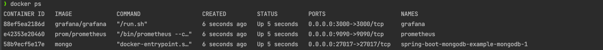
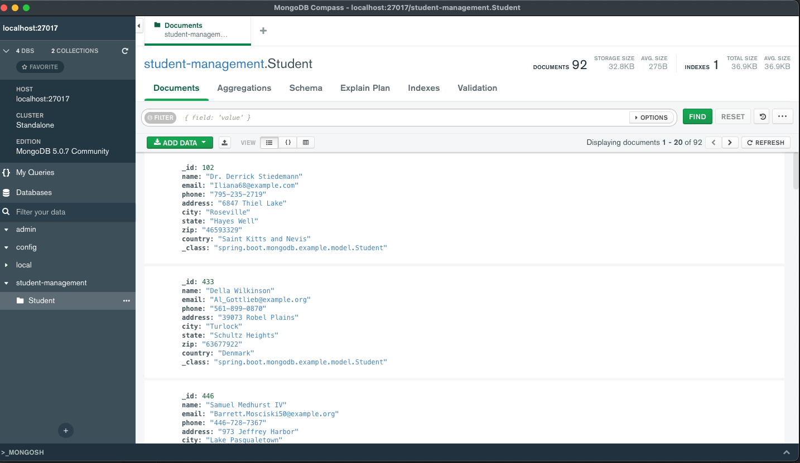
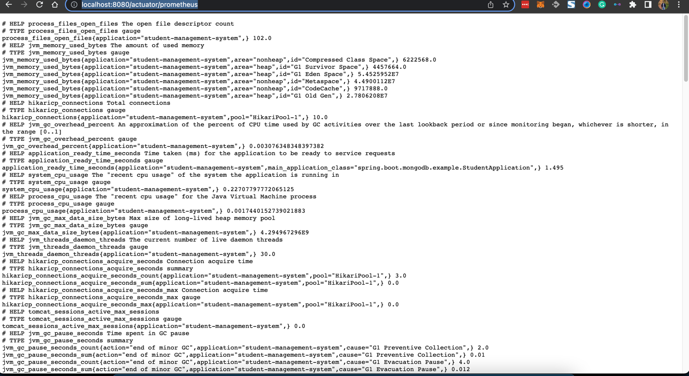

# spring-boot-mongodb-example
[](https://github.com/beemi/spring-boot-mongodb-example/actions/workflows/docker-image.yml)


Spring boot service with mongoDB CRUD example


## Description
This is a simple example of a Spring boot service with mongoDB CRUD.

## Development

Start MongoDB, Prometheus, Grafana, and the service with the following commands:

```shell
docker-compose up -d
```



Connect MongoDB using [Compass The GUI for MongoDB](https://www.mongodb.com/products/compass):



Stop the service with the following command:

```shell
docker-compose down
```

## Running MongoDB as a Docker Container

You can start a MongoDB container using Docker with the following command:

```shell
docker run -d -p 27017:27017 --name mongodb mongo
```

## Gradle build

```shell
gradle bootRun
```

## Access actuator

http://localhost:8080/actuator

http://localhost:8080/actuator/health

## Swagger UI

http://localhost:8090/api-docs/

http://localhost:8090/swagger-ui/index.html


## Prometheus (Monitoring)

http://localhost:8080/actuator/prometheus



Check Prometheus scraping metrics:

Raw metrics:
http://localhost:9090/metrics


http://localhost:9090/graph


## Contacts
Owner: [beemi.raja@gmail.com](beemi.raja@gmail.com)
